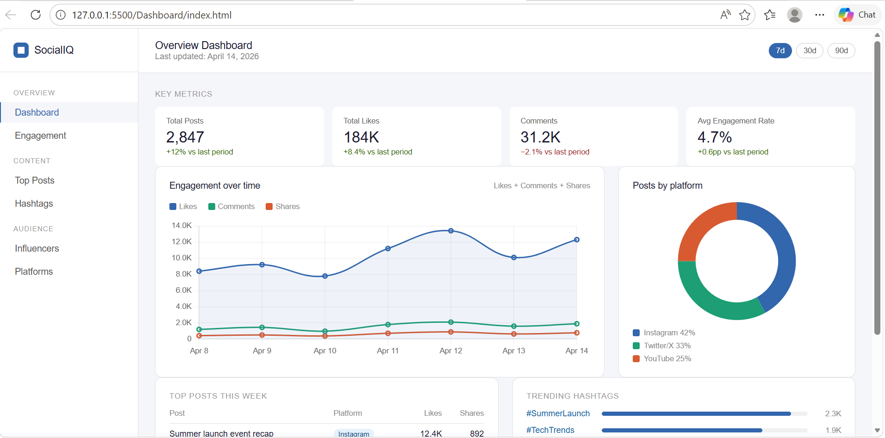

# 📊 Social Media Analytics Dashboard

A DBMS-based group project that analyzes social media data and displays insights using an interactive dashboard.

---

## 🚀 Features
- User & Post Management
- Engagement Analysis (likes, comments, shares)
- Top Performing Posts
- Trending Hashtags
- Data Visualization using Charts

---

## 🛠️ Tech Stack
- Python (Flask)
- SQLite (Database)
- HTML, CSS, JavaScript
- Chart.js

---

## 📂 Project Structure
social_dashboard/
├── dashboard/
├── database/
├── app.py
├── setup_db.py
├── README.md

---

## ▶️ How to Run

1. Install dependencies:
pip install flask pandas

2. Setup database:
python setup_db.py

3. Run app:
python app.py

4. Open in browser:
http://127.0.0.1:5000/

---

## 📸 Screenshot

---

## 👥 Team Members

1. Tanvi Rao (URN: 2481233)  
2. Daksh Kataria(URN: 2481018)  
3. Jiya Singh (URN: 2481117)  
4. Payal Yadav (URN: 2481119)  

---

## 🧠 DBMS Concepts Used
- ER Model
- Normalization
- SQL Joins
- Aggregation (COUNT, GROUP BY)
- Primary & Foreign Keys

---

## ✅ Conclusion
This project demonstrates how DBMS can be used to efficiently store, manage, and analyze social media data with real-time visualization.